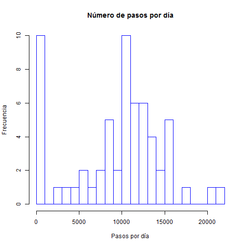
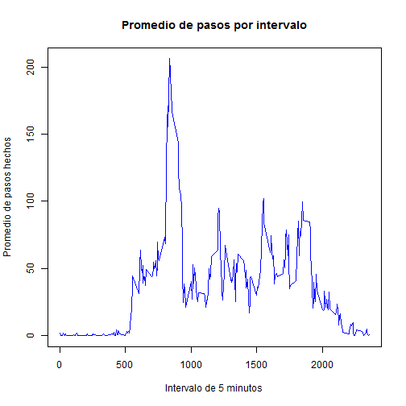
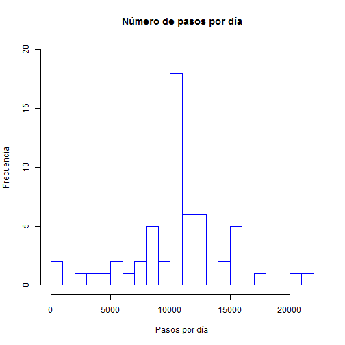
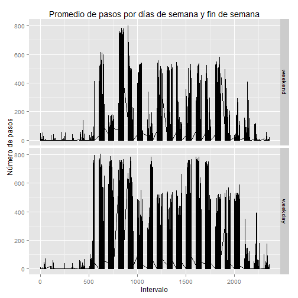

First we read the data


```r
datos=read.csv("C:/Users/Celso/Documents/activity.csv",sep=",",header=T)
```
Next, we calculate the total number of steps taken per day


```r
totalpasos<- tapply(datos$steps, datos$date, sum, na.rm = TRUE)
```

This histogram shows the frequency of daily steps taken.


```r
complete<-complete.cases(datos)
datos2=datos[complete,]
tNA<-nrow(datos)-nrow(datos2)
```

The total number of (missing values) NA's in the database is 2304


```r
hist(totalpasos,main="Número de pasos por día", xlab="Pasos por día",ylab="Frecuencia",breaks=30,border="blue")
```

 


```r
prom<-round(mean(totalpasos),0)

mediana<-median(totalpasos)
```

The mean of the total steps taken is 9354 and the median is 10395


```r
pasosint<- tapply(datos$steps, datos$interval, mean, na.rm = TRUE)
plot(levels(as.factor(datos$interval)),pasosint,main="Promedio de pasos por intervalo", xlab="Intervalo de 5 minutos",ylab="Promedio de pasos hechos",type="l",col="blue")
```

 


```r
maximo=max(pasosint)
inter<-names(pasosint)[which(pasosint == max(pasosint))]
```

The interval which contains the maximum number of steps is 835


```r
        datosnoNA<-datos
        for (i in 1:nrow(datos)) {

        if (is.na(datos$steps[i])==TRUE) {

            intervalo <- as.character(datos$interval[i])
            mediaint <-round(pasosint[intervalo],0)

            datosnoNA$steps[i] <- mediaint
                                         }
                                  }         
head(datosnoNA)
```

```
##   steps       date interval
## 1     2 2012-10-01        0
## 2     0 2012-10-01        5
## 3     0 2012-10-01       10
## 4     0 2012-10-01       15
## 5     0 2012-10-01       20
## 6     2 2012-10-01       25
```

The data set datosnoNA has no missing values


```r
totalpasos2<- tapply(datosnoNA$steps, datosnoNA$date, sum,na.rm=TRUE)
hist(totalpasos2,main="Número de pasos por día", xlab="Pasos por día",ylab="Frecuencia",breaks=30,border="blue",ylim=c(0,20))
```

 

```r
prom2<-round(mean(totalpasos2),0)
mediana2<-median(totalpasos2)
```

The mean of the total steps taken without missing values is 10766 and the median is 10762

*We can conclude that when the missing observations are changed for the meand of steps by interval there is a significant increase in the dayly steps taken which have a direct impact on the mean and median of these variable. These values are bigger than the original ones.


```r
datosnoNA$date<-as.Date(datosnoNA$date)
dias<-as.factor(weekdays(datosnoNA$date))
datosnoNA$dias<-dias
#we have to check that is a weekday or a weekend and rename the factors in the order they are
levels(datosnoNA$dias) #to check the order
```

```
## [1] "domingo"   "jueves"    "lunes"     "martes"    "miércoles" "sábado"   
## [7] "viernes"
```

```r
levels(datosnoNA$dias)<-c("weekend","weekday","weekday","weekday","weekday","weekend","weekday")
```

Now we generate the plane plot

```r
library(plyr)
```

```
## Warning: package 'plyr' was built under R version 3.1.3
```

```r
library(ggplot2)
qplot(datosnoNA$interval,datosnoNA$steps, data=arrange(datosnoNA, date), facets= dias~., geom="line", xlab="Intervalo", ylab="Número de pasos",main="Promedio de pasos por días de semana y fin de semana")
```

 

